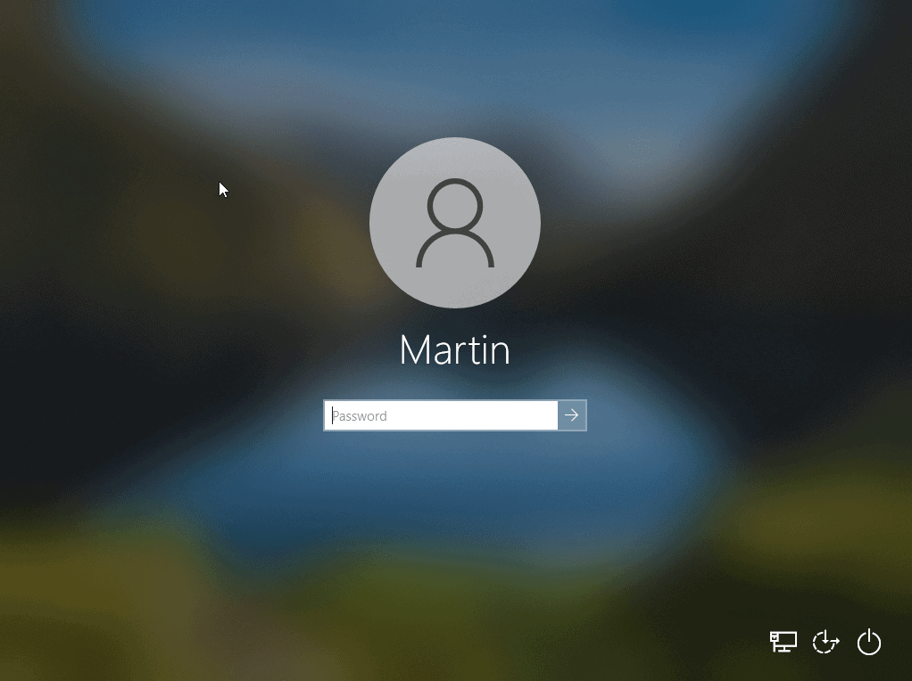

# Konto Użytkownika

notes:
Jest to podstawowy sposób identyfikacji osoby oraz nadania jej odpowiednich uprawnień w danym systemie operacyjnym czy też aplikacji.

# Użytkownik Systemu Windows

notes:
W systemach windows mamy dostęp do 3 podstawowych rodzajów użytkowników:
- Administrator - konto z największymi uprawnieniami, może instalować aplikacje, zakładać nowych użytkowników, zmieniać hasła istniejących użytkowników oraz modyfikować działanie systemu operacyjnego. Administrator może także ograniczać dostęp do funkcji dla zwykłych użytkowników.
- Zwykły użytkownik - konto na którym można uruchamiać aplikacje już zainstalowane ale nie można instalować nowych aplikacji, podczas próby instalacji użytkownik jest proszony o podanie hasła Administratora.
- Konto Gość - tymczasowo utworzone konto którego dane prywatne są usuwane po wylogowaniu się z niego.

Każde z tych kont ma dostęp do prywatnego folderu `Dokumenty` do którego nie ma dostępu żaden inny użytkownik.
Inne foldery poza folderem systemowym są widoczne i dostępne dla innych użytkowników chyba że skonfigurowano je inaczej.
Uprawnienia te możemy zobaczyć kiedy klikniemy prawym przyciskiem na folder, wejdziemy w zakładkę Zabezpieczenia tam mamy listę użytkowników i grup a pod nia mamy informacje o uprawnieniach do konkretnych akcji.

# Użytkownicy aplikacji

notes:
Poza kontami systemowymi często mamy doczynienia z kontami powiązanymi z aplikacjami z których korzystamy.
W szczególności aplikacje płatne wymagają od nas posiadania konta użytkownika w celu powiązania nas z płatnościami za aplikację.

# Sposoby logowania

notes:
Logowanie może różnić się miedzy aplikacjami a nawet między konfiguracjami systemu.
Przeważnie potrzebujemy do tego Loginu oraz hasła zdefiniowanego podczas zakładania konta.
W niektórych przypadkach loginem może być adres e-mail albo identyfikator użytkownika który jest unikalnym ciągiem znaków.
Bardziej bezpieczne systemy oferują logowanie wieloskładnikowe które poza hasłem mogą wymagać podania jednorazowego kodu przesłanego na numer telefonu, adres e-mail lub specjalną aplikację powiązaną z danym kontem.